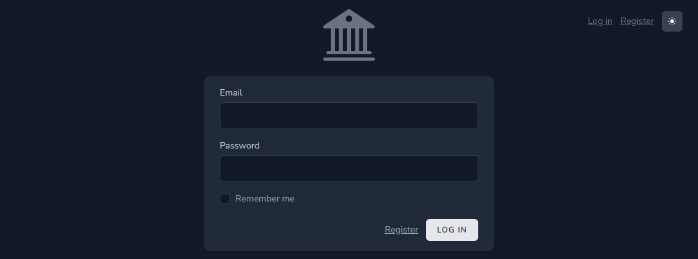
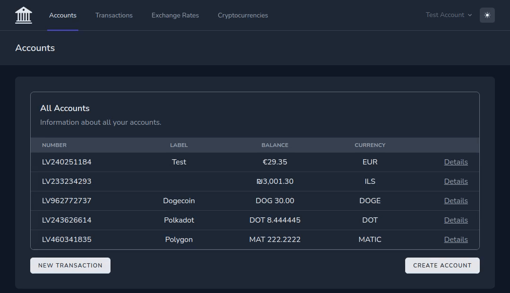
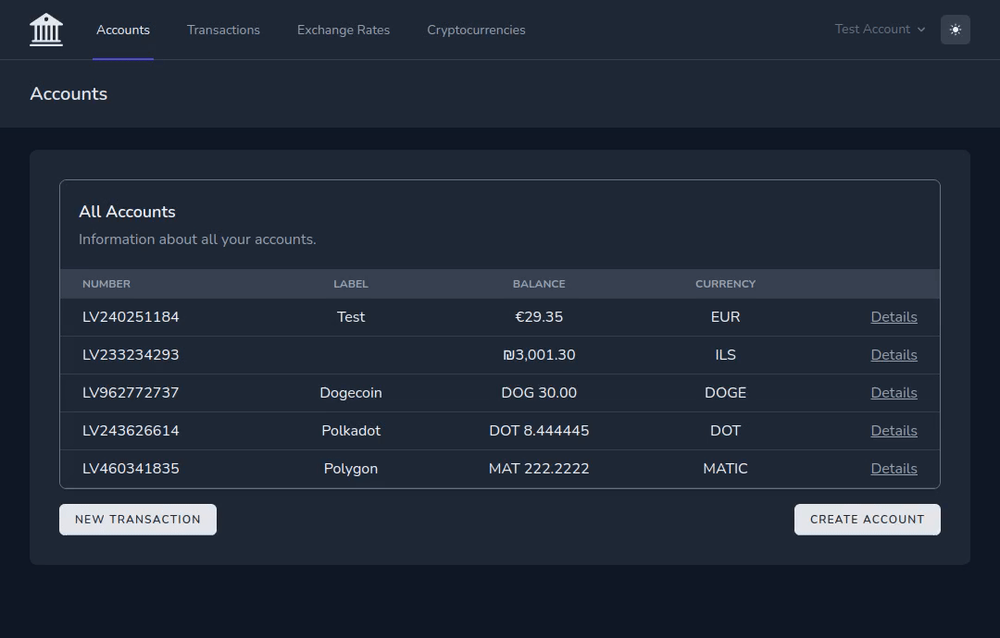
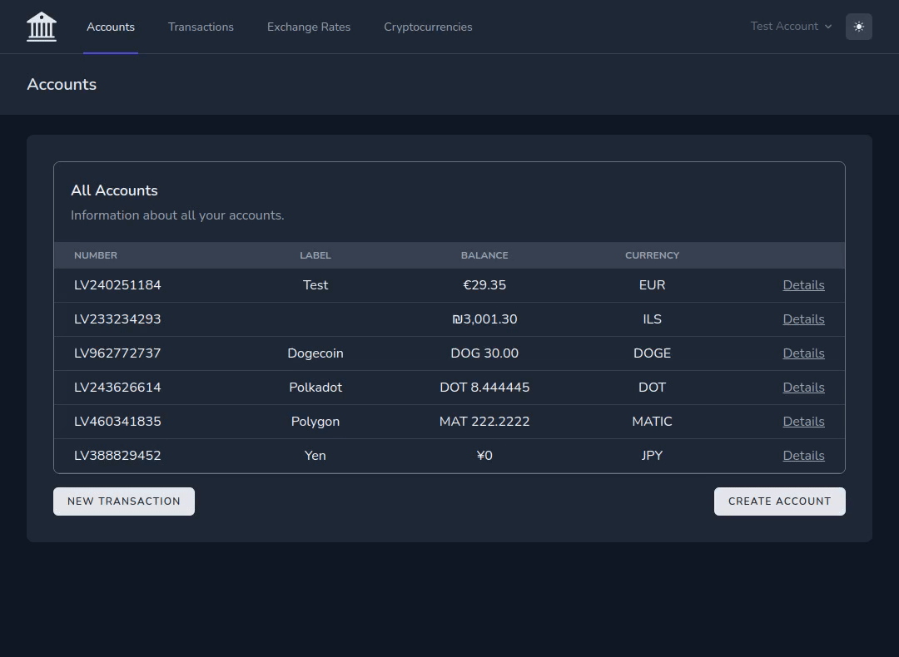
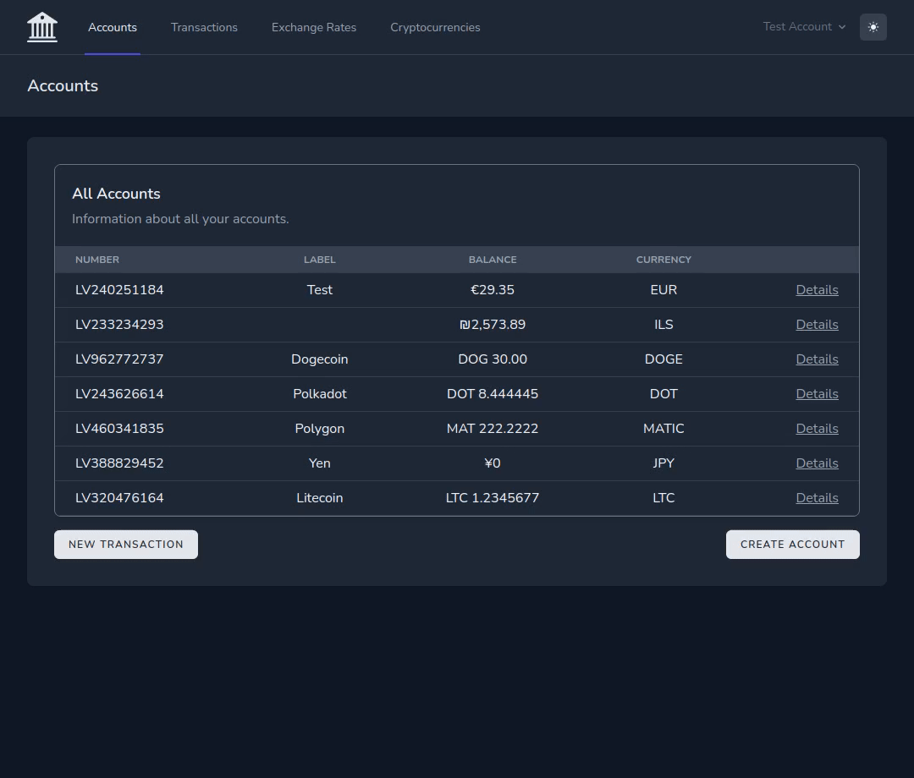

# Laravel internet bank website

## Features

- Change appearance between light and dark mode
- Register a new user, login and logout
- Change user's name, e-mail, password and delete the account
- Refresh user's security codes
- Create standard or cryptocurrency accounts
- View user's accounts, edit account label, close account
- View cryptocurrency price changes from coinmarketcap.com API
- View current currency exchange rates from bank.lv
- Buy and sell cryptocurrencies using standard accounts
- Send currency or cryptocurrency to any other account
- View user's transaction history and filter the results

## Preview

### Login



### Generate new security codes



### Create a new account



### Buy cryptocurrencies



### View transactions



## Technologies used

- PHP 8.2
- mySQL 8.0
- Composer 2.4
- Node.js npm 8.19
- Laravel 9.45

## Instructions to run the website

1. Clone this repository and navigate to its directory by using the commands:
    ```
    https://github.com/tomskoralis/laravel-project
    cd laravel-project/
    ```
2. Install the required packages by using the commands:
    ```
    composer install
    npm install
    ```
3. Make a copy of the `.env.example` and rename the copy to `.env` by using the command:
    ```
    cp .env.example .env
    ```
4. Generate a new `APP_KEY` by using the command:
    ```
    php artisan key:generate
    ```
5. Register at https://pro.coinmarketcap.com/signup and get the API key.
6. Save the API key in the `.env` in the `COIN_MARKET_CAP_API_KEY` variable.
7. Create a new mySQL database schema.
8. Enter the mySQL credentials in the `.env` file. The variable names are: `DB_DATABASE`, `DB_USERNAME`, `DB_PASSWORD`.
9. Run the database migrations and seed the database by using the command:
    ```
    php artisan migrate:fresh --seed
    ```
10. Run the Vite development server using the command:
    ```
    npm run dev
    ```
11. Start the local development server by using the command in another terminal window:
    ```
    php artisan serve
    ```
12. Test the website by opening it in the browser using the URL http://127.0.0.1:8000
